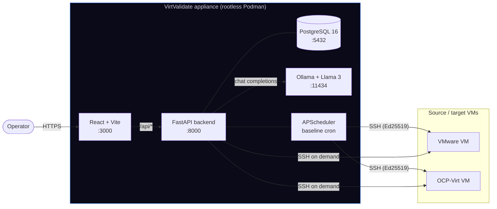

# Architecture

VirtValidate is a four-container appliance that runs entirely inside the
customer's network. **Nothing reaches public APIs at runtime.** All AI
reasoning is performed by a local Ollama instance running Llama 3 (or any
swappable model).

---

## System diagram



If your renderer doesn't speak Mermaid, the same picture in ASCII:

```
  ┌─────────────────────────────────────────────────────────┐
  │                  VirtValidate appliance                 │
  │                                                         │
  │   React (3000)  ──────►  FastAPI (8000)                 │
  │                              │  │  │                    │
  │                              │  │  └─► APScheduler      │
  │                              │  ▼                       │
  │                              │  Ollama + Llama 3 (11434)│
  │                              ▼                          │
  │                          PostgreSQL (5432)              │
  └────────────────────────────┬────────────────────────────┘
                               │ SSH (Ed25519, outbound only)
                               ▼
                    ┌──────────────────────┐
                    │  Enrolled VMs        │
                    │  (VMware + OCP-Virt) │
                    └──────────────────────┘
```

The dashed boundary is the **air-gap**. Outbound SSH on port 22 to the
target subnets is the only network egress required after first install.

---

## Components

### Frontend (`frontend/`)

- React 18 + Vite, no SSR, served by nginx in production.
- One SPA with routes `/` (dashboard) and `/settings`.
- Talks to the backend via `/api/*`. The Vite dev server proxies and
  strips the `/api` prefix; in production, nginx handles the rewrite.
- Toasts via `react-hot-toast`. CSV/XLSX parsing client-side via
  SheetJS. PDF export is server-rendered.

### Backend (`backend/app/`)

| Path | Responsibility |
|------|----------------|
| `api/vms.py`        | VM CRUD + bulk enrollment + per-VM snapshot/baseline/validation reads |
| `api/plans.py`      | Plan creation, listing, wave reports (JSON + PDF) |
| `api/health.py`     | Ollama and PostgreSQL health probes |
| `api/settings.py`   | Settings CRUD, SSH public key, available Ollama models |
| `api/audit.py`      | Read-only audit trail |
| `core/ssh.py`       | Paramiko-based SSH collector (parsers per command) |
| `core/llm.py`       | Diff engine + Ollama chat client for verdicts |
| `core/planner.py`   | Wave-grouping prompt + strict response validation |
| `core/reporter.py`  | CISO-grade summary + weasyprint HTML→PDF |
| `core/baseline.py`  | Profile synthesis across multiple snapshots |
| `core/scheduler.py` | APScheduler job that drives baseline collection |
| `core/audit.py`     | URL→action mapping + audit row helper |
| `middleware/audit.py` | Records every POST/PUT/PATCH/DELETE |

### PostgreSQL

Holds:

- `vms` — enrollment record (name, source/target hostname, IP, OS, role, ssh_user)
- `baseline_snapshots` — JSONB-typed structured state per (vm, collected_at)
- `validation_results` — per-VM verdict from the LLM
- `migration_plans` — full plan with `waves` and `vm_ids`
- `app_settings` — singleton row holding `ollama_model` and `schedule_preset`
- `audit_logs` — append-only trail

The `JSONType` defined in `app/core/db.py` is `JSONB` on PostgreSQL and
plain `JSON` on every other dialect — that's how the SQLite-backed test
suite stays fast without a Postgres service.

### Ollama

Runs the local LLM. Three modules call it:

1. `core/llm.py:LLMClient.validate()` — pre/post diff → `pass / warn / fail` verdict.
2. `core/planner.py:MigrationPlanner.plan()` — wave grouping with role + dependency reasoning.
3. `core/reporter.py:WaveReporter.generate()` — CISO-grade executive summary per wave.

All three pin `format=json` and `temperature=0.1–0.2`, then strictly
validate the response shape; the planner rejects unknown vm_ids,
duplicates across waves, missing VMs, and invalid risk levels.

### APScheduler

A `BackgroundScheduler` started in the FastAPI lifespan. The cron
trigger is read from `app_settings.schedule_preset`:

| preset | cron |
|--------|------|
| `twice_daily` (default) | `hour=6,18 minute=0` |
| `once_daily`            | `hour=6 minute=0` |
| `hourly`                | `minute=0` |

Saving the schedule on the **Settings** page calls
`reschedule_baseline_job()` so the change applies without a restart.

---

## Data flow: a VM's life cycle

```
ENROLLED ──► BASELINE_CAPTURED ──► MIGRATED ──► VALIDATED
   │                │                  │            │
   │                │                  │            └── Wave report
   │                │                  └── Validation engine reasons
   │                └── Scheduler captures via SSH (twice daily)
   └── Operator adds VM via UI / CSV / RVTools
```

1. **Enrollment** — operator enters a hostname (manual / CSV / RVTools
   XLSX). Backend writes to `vms`. Audit row: `vm.create` /
   `vm.bulk_create`.
2. **Baseline** — APScheduler SSHes into each VM, parses the structured
   state, writes a `baseline_snapshots` row. Audit row:
   `baseline.collected`. Multiple snapshots per VM build a profile via
   `synthesize_profile()`.
3. **Migration** — happens externally (your VMware → OCP-Virt move).
4. **Validation** — the validator SSHes into the migrated VM, asks Llama
   3 to compare against the synthesized baseline profile, writes a
   `validation_results` row.
5. **Planning** — operator selects VMs and clicks *Generate Plan*. Llama
   3 infers roles, groups into waves (stateful first, edge last), risk
   score per wave.
6. **Reporting** — for each wave, Llama 3 writes the CISO summary;
   weasyprint renders the HTML → PDF. Audit row: `report.export`.

---

## Why air-gapped

VM migration data — hostnames, internal IPs, running services, mounted
filesystems — is sensitive. The architectural choices that protect it:

- **Local LLM**: every prompt and every diff stays inside the appliance.
  The codebase contains zero references to OpenAI, Anthropic, or any
  hosted inference provider.
- **No outbound HTTP except Ollama**: the only `httpx.Client` calls in
  the backend target `OLLAMA_HOST`. Container egress can be blocked at
  the host firewall after install.
- **Outbound SSH only**: the appliance never accepts inbound connections
  from target VMs.
- **Append-only audit**: `audit_logs` has no update/delete API. Every
  mutation is recorded with method + path + status + actor.
- **Settings UI exposes the public SSH key only**; the private key never
  has a read path beyond the in-process loader that signs SSH sessions.

---

## Operational quick reference

| What | Where |
|------|-------|
| API base | `:8000` (proxied as `/api` from the dashboard) |
| Database | `postgres:5432` inside compose |
| LLM | `ollama:11434` inside compose |
| SSH key | `backend/app/keys/id_ed25519` (mounted as `/app/keys/id_ed25519`) |
| Audit trail | dashboard *audit log* tab, or `GET /api/audit` |
| Schedule | dashboard *Settings → Baseline Schedule* |
| OpenAPI spec | `GET /openapi.json`, also rendered at `/docs` |

Every other knob is documented in [CONFIGURATION.md](CONFIGURATION.md).
